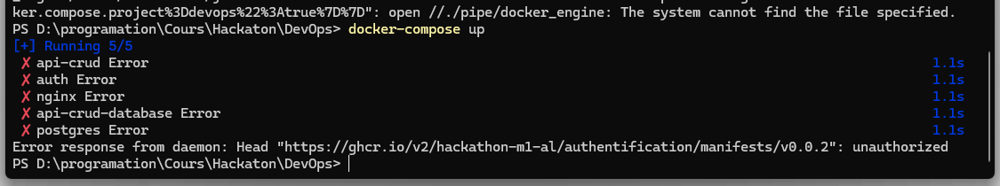
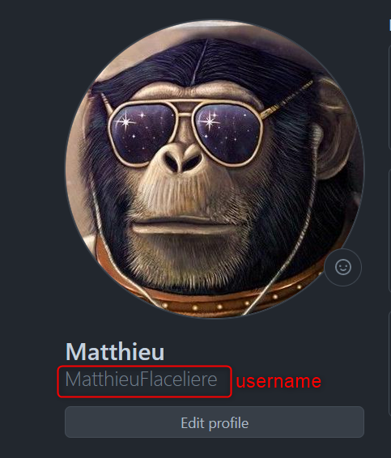

# Welcome to Docathon 🎉

Lien github de l'organisation: [Hackathon]("https://github.com/Hackathon-M1-AL")

## Installation du projet 🚀

### Prérequis 📋

-   [Node.js](https://nodejs.org/en/)
-   [Npm](https://www.npmjs.com/)
-   [Git](https://git-scm.com/)
-   [Docker](https://www.docker.com/)
-   [Docker-compose](https://docs.docker.com/compose/)

### Installation 🖥️

Installer du frontend:

```bash
git clone https://github.com/Hackathon-M1-AL/Frontend
cd Frontend
npm install
npm run preview
```

Dans un autre terminal, installer du backend:

```bash
git clone https://github.com/Hackathon-M1-AL/DevOps
cd DevOps
docker-compose up
```

## Troubleshooting ⚙️

### Problème de connexion au registy des images Docker 🐳



Pour résoudre ce problème, il faut se connecter au registy des images Docker. Pour cela, il faut suivre les étapes suivantes:

1. Création d'un personal access token sur Github

Github > Settings > Developer settings > Personal access tokens > Tokens (classic) > Generate new token (classic)

-   Sélectionnez l’étendue `read:packages` pour télécharger des images conteneur et lire leurs métadonnées.
-   Sélectionnez l’étendue `write:packages` pour télécharger et charger des images conteneur et lire et écrire leurs métadonnées.
-   Sélectionnez l’étendue `delete:packages` pour supprimer des images conteneur.

2. Copier le token généré

3. Se connecter au registy des images Docker

```bash
docker login docker.pkg.github.com -u <username> -p <token>
```


